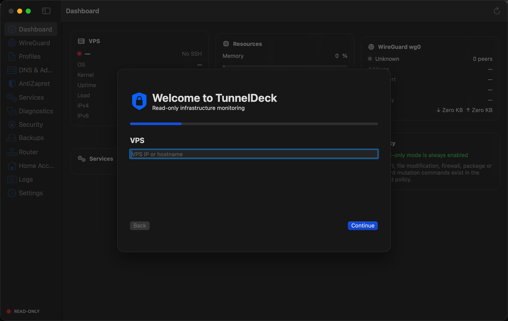

# TunnelDeck 1.2.5

Native macOS control panel for a self-hosted WireGuard, AntiZapret and AdGuard Home VPS. Built with Swift, SwiftUI and the system OpenSSH client—no Electron, embedded terminal, passwords or private keys in the app bundle.



## Features

- Live VPS, CPU, memory, disk, uptime and connectivity dashboard.
- WireGuard interface and peer status with handshake and traffic data.
- Safe peer creation/removal with backups, validation and exact rollback.
- AntiZapret, OpenVPN and AdGuard Home service discovery.
- DNS listener exposure warnings and redacted local logs.
- Profiles, QR export, diagnostics, backup inventory and menu-bar status.
- One-click Doctor checks SSH, WireGuard, forwarding, NAT, DNS, services, resources, listeners and firewall state.
- State-change monitoring, configuration-drift detection, multi-VPS profiles and a redacted activity trail.
- Daily in-app scheduled backups with 14-backup server retention and local Emergency Kit export.
- Read-only mode by default; write mode requires an explicit confirmation and matching helper version.

## Requirements

- Apple Silicon Mac running macOS 14 or newer.
- Xcode 16 or newer for development builds.
- Ubuntu VPS with key-based SSH access.
- Existing WireGuard interface named `wg0` for peer management.
- Python 3, `wg`, `wg-quick`, `systemctl` and standard Linux utilities on the VPS.

TunnelDeck does **not** create or replace the WireGuard server. It manages peers on an existing installation and never regenerates the server private key.

## Install

### Build in Xcode

```bash
git clone https://github.com/seruyvodoley/TunnelDeck.git
cd TunnelDeck
open TunnelDeck.xcodeproj
```

Select the TunnelDeck scheme and run it on **My Mac**. Release builds can also be produced with:

```bash
swift build -c release
```

The repository does not contain credentials, server addresses or production VPN configurations.

## First launch

1. Enter your VPS hostname or IP address.
2. Enter the SSH port and user.
3. Select the local private-key path, such as `~/.ssh/id_ed25519`.
4. Verify the server fingerprint in `~/.ssh/known_hosts` through a trusted channel.
5. Run **Test SSH**, then **Discover infrastructure**.

TunnelDeck invokes `/usr/bin/ssh` with `IdentitiesOnly=yes`, batch authentication, timeout handling and strict host-key checking. The private key stays on the Mac and is never copied to the VPS.


## Server helper

Write operations use the audited, versioned helper in `ServerHelper/tunneldeck-helper`. Review it before installation:

```bash
shasum -a 256 ServerHelper/tunneldeck-helper
scp ServerHelper/tunneldeck-helper user@your-vps:/tmp/tunneldeck-helper
ssh user@your-vps
sudo install -o root -g root -m 0750 \
  /tmp/tunneldeck-helper /usr/local/libexec/tunneldeck-helper
sudo /usr/local/libexec/tunneldeck-helper version
sudo /usr/local/libexec/tunneldeck-helper health
```

The helper exposes fixed subcommands only. It rejects arbitrary shell commands, validates names, addresses, endpoints and WireGuard keys, and writes configuration atomically. See `SERVER_HELPER.md` for the complete command contract.

## Read-only and write modes

Read-only mode is always available and is the default. It runs only commands declared by `ReadOnlyCommandPolicy`.

Write mode is enabled in Settings and permits only `WriteCommandPolicy` helper operations. Before each supported mutation the helper creates a scoped backup under `/root/tunneldeck-backups/`, records hashes and health information, validates the candidate configuration, applies it, then performs a post-health check.

Never enable write mode until you have verified SSH recovery access and an independent VPS console.

## WireGuard peers

TunnelDeck reads the subnet and server address from `/etc/wireguard/wg0.conf`, proposes an unused host address, and derives the endpoint from the VPS setting and detected listen port.

Adding a peer:

1. Creates a server backup.
2. Generates client keys on the VPS without logging them.
3. Validates the candidate with `wg-quick strip`.
4. Writes `wg0.conf` atomically.
5. Applies the peer live with `wg set`—without restarting `wg0`.
6. Saves a mode-`0600` client profile and downloads it securely.
7. Rolls back if validation fails.

Existing peers are distinguished from TunnelDeck-managed peers using `/root/tunneldeck/peers.json` and require stronger confirmation before removal.

## AdGuard Home and AntiZapret

TunnelDeck detects services and sockets independently from clean WireGuard. Wildcard DNS listeners such as `0.0.0.0:53` and `[::]:53` are reported as critical exposure. It does not silently rewrite AdGuard or Knot Resolver configuration.

Service start, stop and restart actions require write mode, an explicit per-operation confirmation, a matching helper, a scoped backup and a successful state check.

## Scheduled backups and Emergency Kit

When Write Mode is enabled and TunnelDeck is running, it checks once per refresh whether 24 hours have elapsed since the last scheduled backup. The helper captures the relevant WireGuard, TunnelDeck metadata, AntiZapret and AdGuard configuration plus firewall, routes and service health, then retains the newest 14 backup directories.

Emergency Kit creates a mode-`0600` public-only ZIP containing public server metadata, the latest backup manifest reference, health report and recovery notes. Client profiles are excluded because they contain private credentials. Server private keys, SSH keys, passwords and AdGuard credentials are never included.

## Verified restore

Helper 1.2 confines manifest paths to the selected backup, rejects symlinks and traversal, verifies SHA-256, and permits only typed allowlisted targets. Restore creates a current-state backup, writes atomically, syncs or restarts only the relevant service, validates health and rolls back on failure.

## Approved listeners and AdGuard API

SSH and the detected clean WireGuard port form the automatic public baseline. Other listeners require explicit per-VPS approval; ports 53 and 3000 can never be approved. AdGuard URL and credentials are stored per VPS in Keychain, and its official status, statistics, query-log and filtering APIs are read without logging authorization data.

## Security model

- No bundled passwords, SSH keys, VPN profiles or server IP addresses.
- No `StrictHostKeyChecking=no`, `shell=true`, `eval` or arbitrary-command endpoint.
- Secrets are redacted before UI display and local logging.
- PrivateKey, PresharedKey, authorization headers, bearer tokens, cookies and passwords are masked.
- No automatic package, distribution, kernel or operating-system upgrades.
- No router login or reverse-engineered vendor API.

Read `ARCHITECTURE.md` for the application, SSH and transaction design. Read `RECOVERY.md` before enabling write mode.

## Tests

```bash
python3 -m unittest -v Tests/ServerHelperTests.py
swift test
```

`swift test` requires a full Xcode installation because the suite uses Swift Testing macros. The helper tests use system Python and never connect to a production server.

## 1.2.5 Security 2.0

- Security groups IPv4/IPv6 sockets into logical services and labels clean WireGuard, AntiZapret WireGuard, full-VPN WireGuard, AntiZapret/OpenVPN and SSH from live server metadata instead of raw ports alone.
- Private AdGuard/WireGuard listeners are shown separately from internet-facing services; public AdGuard DNS or web binds remain critical.
- A read-only SSH audit reads the effective `sshd -T` policy and highlights public-key, password, keyboard-interactive, root-login, empty-password, port and MaxAuthTries settings.
- The Security screen summarizes successful and failed/suspicious SSH journal events from the last 24 hours and shows the most recent successful login line.
- Security Audit never edits sshd, firewall, VPN or service configuration.

## 1.2.4 AdGuard dashboard and DNS Path Test

- AdGuard Home now shows blocked percentage, last API refresh, top queried/blocked/client lists, active filters and a structured recent-query table with client, status and rule.
- The AdGuard API refreshes every 15 seconds while its screen is open; credentials remain in Keychain.
- Diagnostics adds a read-only DNS Path Test comparing macOS system resolvers, the current default gateway, the private AdGuard resolver and Cloudflare DNS.
- The path test verifies a known advertising domain and reports whether macOS uses AdGuard, whether blocking is active and whether the router resolver bypasses filtering.
- DNS diagnostics run locally and never change router, macOS or VPS configuration.

## 1.2.3 Doctor noise reduction

- Doctor discovers all active WireGuard listen ports from `wg show all` and treats them as expected VPN listeners.
- Active OpenVPN sockets are recognized from the discovered OpenVPN services instead of being reported as unknown public listeners.
- IPv4/IPv6 duplicates of the same unknown listener are collapsed into one warning.
- Never-connected WireGuard peers are named by allowed IP and can be ignored for health per VPS, with a reset control in Monitoring.

## 1.2.2 functional-correctness fixes

- Doctor builds each report from fresh command results instead of cached dashboard state.
- Health distinguishes **Critical** infrastructure/security problems from an actually **Offline** VPS.
- Public listeners include wildcard binds and services bound directly to the configured public VPS address.
- AdGuard Home web/API endpoint is discovered from the live AdGuard listener instead of assuming port 3000.
- AdGuard login validates credentials before closing the login sheet and reports authentication versus connectivity failures.
- The macOS app expects the deployed server helper version 1.2.1.

## Known limitations

- Client credentials cannot be included in Emergency Kit until a verified encrypted-container implementation is available.
- Temporary AdGuard allow rules remain disabled pending transactionally verified expiry cleanup.
- Channel throughput benchmarking and full TLS certificate metadata remain future transport work.
- iperf execution is manual and is never started automatically.
- Router configuration is intentionally not automated.
- The current peer-management helper expects the clean interface to be named `wg0`.

## Contributing

Issues and focused pull requests are welcome. Never attach production configs, private keys, PSKs, public server addresses, unredacted logs or backup manifests to an issue.

## License

MIT. See `LICENSE`.